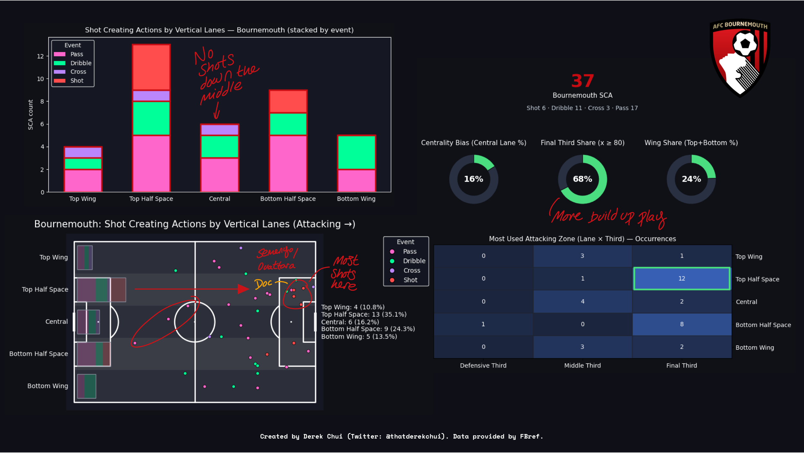

# Football Analytics

This repo contains the projects, tools, and resources for football data analysis & visualisation. Commonly used tools include Python, Web Scraping, NumPy, Pandas, Matplotlib, Seaborn, and Jupyter Notebook. Several visuals from various projects can also be found on Twitter ([@thatderekchui](https://x.com/thatderekchui)).

Click on the arrows to select and expand each project for more details!

## Contents

### Latest Projects (In Progress)
- [Project 3 - Players Actions v Usage Rates](#3---player-actions-v-usage-rates)
- [Case Studies](#case-studies)

### Completed Projects
- [Project 2 - 2025 Summer Squad Assessment](#2---2025-summer-squad-assessment)
- [Project 1 - Progression Analysis (24/25)](#1---progression-analysis-2425)
- [Player Dashboard](#player-dashboard)
- [Match Reviews](#match-reviews)

## 3 - Player Actions v Usage Rates

- **Source(s)**: [FBref](https://fbref.com/en/), [Transfermarkt](https://www.transfermarkt.com/)
- **Folder**: [Project 3](./Project%203/)
- **Summary**: Comparing various player on field actions with usage rates (how often the player has the ball). This will determine whether or not a player is productive / efficient with the ball and if the player deserves to have the ball as much as they do. Heavily inspired by [this video](https://www.youtube.com/watch?v=iydcB3OM6EE).

  
3.9 - Center Back Possessions Disrupted

  - **Code**: [project3-9.ipynb](./Project%203/Project%203.9/project3-9.ipynb)  
  - **Summary**:
    I wasn't expecting Santiago Bueno to be this efficient. Lowest usage of all yet putting up 4+ possessions disrupted on average per 90.

    Also we see the exact same shift in quality I was mentioning with wing backs. All our current center backs are towards the bottom of the chart (other than Santiago Bueno of course).

    Boly, Collins, Kilman, Dawson, are all players that we never really paid much attention to when they were here. Yet our current players make their numbers look great.

    Also, these players have the highest possessions disrupted rates especially Boly and Saiss, who is further down just because of his higher usage.

  

    
  

  The good is that just like with the wing backs, the most tackles won are current players, but this time in Toti and Santiago Bueno once again. Collins and Boly with the most blocks.

  This is the last section of project 3. With the data and graphs we're able to see the player types Wolves are missing (and that have previously been proven to be vital in the system).

  From this we can mark down these attributes and scout players with outstanding metrics in these area while being of good value. I'll be referring back to this as I look for potential prospects for the winter transfer window for sure.
  
  

    
  

  
3.8 - Midfielders Possessions Disrupted

  - **Code**: [project3-8.ipynb](./Project%203/Project%203.8/project3-8.ipynb)  
  - **Summary**:
    Since there's a wide variety of midfielders the graph is sort of all over the place. Can see the difference between ball playing CMs or progressive types.

    Many already expected this but I didn't expect Andre to stand out this much. 4.55 possessions disrupted while having the lowest usage rates. He's definitely a player I'll look further into.
    
    Surely there are other players just like him in Europe that are overlooked as well.

    Note how Bellegarde has the highest usage but almost the lowest possessions disrupted. That doesn't mean he's a bad player at all. He was among the best when it came to progression and SCA earlier in this project.

  

    
  

  Another player I'd like to emphasize is Boubacar Traore. He's out on loan right now but 2.53 tackles won per 90 is impressive for Wolves.

  Neves on the other hand had the most blocks and interceptions. Maybe this is the type of player we're missing.

  Lemina is a fair shout as well.
  
  

    
  

  
3.7 - Wing Back Possessions Disrupted

  - **Code**: [project3-7.ipynb](./Project%203/Project%203.7/project3-7.ipynb)  
  - **Summary**:
    Sad to see the decline in the quality of the squad over the past few years. Not just in the eye test but in actual data. 

    All our departed wing backs are situated above the regression line.
    
    On the other hand you could argue our current wing backs are much more progressive now (so higher usage).

    Hugo Bueno is the only current player with efficient defensive rates. Plus the quality he brings offensively compared to other players we have right now. Unfortunately like the rest of the squad he isn't implemented properly.

  

    
  

  Previous players like Jonny or Marcal may have had their data overlooked, both being defensively efficient.

  What suprised me is that Rodrigo Gomes and Hoever had the most tackles won on average at around 1.77 per 90.

  But overall the shift in quality is evident and it shows in the data.
  
  

    
  

  
3.6 - Midfielder Progressive Actions

  - **Code**: [project3-6.ipynb](./Project%203/Project%203.6/project3-6.ipynb)  
  - **Summary**:
    Back at it with more analysis 11 gameweeks in. Hopefully with more time over thanksgiving and christmas break I'm able to finish project 3.

    Graph below shows Bellegarde and Joao Gomes being among the more productive midfielders at Wolves even recently.

    Matheus Nunes stands out the most in his last season at Wolves, with high progression even with fair usage. Joao Moutinho as well.

  

    
  

  I recall seeing a post about how even current Moutinho would start over anyone at Wolves. The graph certainly shows that.

  Moutinho is probably the only one we can consider very productive, with fair usage yet high amounts of progressive actions as well.

  Interesting to see how Bellegarde stands out in many categories, even in previous projects.

  Notice how more attacking midfielders have higher progressive receptions, while others have higher ratios of progressive passes.
  
  

    
  

  
3.5 - Attacking Midfielder Progressive Actions

  - **Code**: [project3-5.ipynb](./Project%203/Project%203.5/project3-5.ipynb)  
  - **Summary**:
    Beginning of this project I was trying to compare player actions with value but I've realised that it doesn't exactly work well with a metric like usage rates. For example, there could be someone that is valued at a lower price while having a high usage rate because he was the "main man" at their previous team, but it doesn't reflect their productivity well. However reflecting player actions with usage rates could prove useful. [Last subsection](./Project%203/Project%203.2/project3-2.ipynb) I compared shot creating actions with CAMs, and in this one I will do the same but with Progressive Actions.

    Progressive Actions are a combination of Progressive Carries, Passes, and Pass Receptions. It's a great insight, other than goal scoring threat metrics, that shows the value of an attacker that isn't necessarily directly involved with scoring goals.
    
    As previously mentioned, usage rates are measured based on miscontrolls, dispossessions, incomplete passes, failed take ons, and shots.

    Graphing these metrics can help clubs spot productive and wasteful players, or whether a player should be getting the ball as much as they do.

  

    
  

  When plotted, it's easy to see who the most progressively efficient players are at the club. Players like Fer Lopez and Arias stand out. Obviously, they played in different and less demanding leagues, but this could be good insight to see what sort of value they can give should they get the ball more often. Players like Cunha or Sarabia would've had even better stats if they played in less challenging leagues.

  Fer Lopez stands out to me as someone who is very productive on the ball. We saw this in 3.2 with shot creating actions, and it's no suprise we see the same in usage rates. I won't be suprised if it's the same for npxG+xA either. He also has the best PrgC and PrgP, but that's also considering he didn't play as much as the other players on the chart.

  This can also apply to wing backs or midfielders. The likes of Rodrigo Gomes and Hugo Bueno would undoubtedly be among the more progressive and efficient players at the club.
  
  

    
  

  
3.4 - Wing Back Progressive Actions

  - **Code**: [project3-4.ipynb](./Project%203/Project%203.4/project3-4.ipynb)  
  - **Summary**:
    Hugo Bueno and Rodrigo Gomes are both great progressive options in the wing back role. In fact I think they're both underutilized (like Fer Lopez) in the squad, and the loss against Newcastle only proves that.

    Tchatchoua, despite not having the best stats, and not getting the ball much back in Verona, did have a good amount of Progressive Actions and made it count. Interested to see how this would change should he get the ball more often.

    I also changed the circle size from G+A to player value, since G+A isn't as relevant with wing backs imo.

  

    
  

  Our current wing backs are arguably more progressive than previous ones, but there are other qualities that are lacking.
  
  

    
  

  
3.3 - Attacker Expected Goal Contributions

  - **Code**: [project3-3.ipynb](./Project%203/Project%203.3/project3-3.ipynb)  
  - **Summary**:
    Inspired by [this post](https://x.com/fc_mossman/status/1967663639697195320) which showed the CAM/Winger final third efficiency. Basically how many final third touches does a player take vs expected goal contributions. Since I was doing a project on usage rates, I thought it would be a good idea to swap out final third touches with usage to see how it would change.

  

    
  

  I did the thing but with all recent attackers. I've covered Tolu's inflated shot volume at Belgium back in [section 2.8](./Project%202/Project%202.8/stcomp.ipynb), so it makes sense why he stands out.

  Other than that, Larsen, Kalajdzic, Jimenez, and Fer Lopez are among the most efficient, considering their usage rate. Also important to note Larsen's impressive shot ratios, which I also covered in 2.8. The difference is that Larsen performs way above his npxG, while Tolu does the opposite (despite scoring more).
  
  

    
  

  We can see similar results to progressive actions too, with Cunha and Sarabia not only being progressive but contributing as well (but also having the ball a lot).

  If we split it in between npxG and xA, the graph is fairly similar with npxG. But for xA, we see players like Fer Lopez and Bellegarde stand out as among the more creative playmakers, even without having the ball too much.

  

    
  

  Figured I could make a quick minor update on 3-3

  There's been several changes in data between GW 1 and GW 11, so here it is.

  Tolu's npxG dropped a bit, but that's expected since he's not in the EPL instead of Belgium.

  Arias' usage dropped but his npxG is similar. He's not really the main man at Wolves compared to in Brazil.

  

    
  

  We can see the same shift in Arias' performance: lower usage and lower xA.

  Again, Tolu's xA is going down as well, even with the same usage rates.

  Lastly, Fer Lopez has increased usage and xA, even in the EPL. Looking forward to how this reflects at the end of this season.

  

    
  

  
3.2 - Attacking Midfielder Shot Creating Actions

  - **Code**: [project3-2.ipynb](./Project%203/Project%203.2/project3-2.ipynb)  
  - **Summary**:
    Fairly easy to transition to usage rates for attacking midfielders once strikers were completed. A few insights:

    Both Jhon Arias and Fer Lopez top the charts. In simple terms, this means that they should be given the ball more often and will provide the most opportunities. Interesting enough, Arias actually has more SCA per 90 than Cunha, even with less usage rate than Cunha. So there is huge potential and upside to that if Arias manages to get the ball as much as Cunha did with Wolves in the prem. Lopez is one to watch as well. Compared to the likes of Guedes and Sarabia, his SCA is much higher than the both of them.

    Not exactly too suprised to see Hwang having the least SCA (even less than Munetsi). 

  

    
  

  I realize that this graph is still flawed. Since player value and usage rates don't exactly grow linearly, the lower valued players will usually float to the top. One way I can fix this now is to just split them up into price ranges and evaluate them from there, especially if they're out of order.

  The 5 million price range revealed that Sarabia actually got a lot of the ball for his price point. If Fer Lopez can grow into that sort of high usage role, that would be great.

  In the 10 - 20m price range, Arias stands out. He has the highest usage of all, despite not being the cheapest.

  Overall, low value but high usage players include the likes of Arias, Lopez, Guedes, and Sarabia. Sarabia actually has similar usage rates as Cunha, despite being much cheaper.

  Perhaps a better way to utilize usage rates is to see who is the "main man" on their team. History tells us that putting a bunch of main men together in a team don't really work well. But having one focal point that is effective, while having others that're efficient off the ball, is crutial in achieving balance within a team.
  
  

    
  

  
3.1 - Striker Shot Creating Actions

  - **Code**: [project3-1.ipynb](./Project%203/Project%203.1/project3-1.ipynb)  
  - **Summary**:
    Saw [this video](https://www.youtube.com/watch?v=iydcB3OM6EE) the other day and I got me thinking about Usage Rates. While it's mainly used in the NBA, usage rates are a great way to show how often a player gets the ball (whether or not they're the main man) and how efficient / productive they are with it. In football, this can be calculated by the sum of miscontrols, dispossessions, incomplete passes, failed take ons, and shots

    Some strikers get the ball a lot (like Cunha) and produce just as much results. Others get the ball a lot but doesn't convert them well, and so shouldn't really get the ball as much. There are also those that rarely get the ball, but makes it count whenever they do. In that case, they should be getting more of the ball, relative to the entire team.

    Just like in the video mentioned, I plotted the SCA and Usage Per 90 for all recent Wolves strikers. It's no suprise that Cunha is in the top right, and clearly deserving the volume of involvement he gets. Tolu impresses as well, seemingly having a similar trajectory as Cunha.

    On the other hand, those like Larsen, despite having both low usage and SCA, has high G+A, simply because he isn't that involved in the build up.

    What stands out however, is Willian Jose. While his stint at Wolves as a short term replacement for Jimenez wasn't too successful, the shot creating actions he was able to generate, considering his very low usage, is impressive. This makes him on par with the likes of Tolu and Cunha.

  

    
  

  Now since this project is about player valuations, lets take a look at how well a player uses the ball with value. Once again we see Cunha having both high value and usage. Tolu has great usage considering his price range, so does Kalajdzic (who had just left to LASK on loan). Since price and usage don't grow at the same rate, naturally cheaper players will have the highest "value per million". But it's easier to see the ones that stand out by separating them by price range, as seen on the graphs below.

  

    
  

  The idea of usage rates is so underused in football. I won't be suprised to Wolves decided to go after Uche due to his usage rate.

  

    
  

## Case Studies

- **Source(s)**: [FBref](https://fbref.com/en/)
- **Folder**: [case-studies](./case-studies/)
- **Summary**: Detailed analysis and player comparisons. Extended version of threads posted on X. Some code drawn from tools developed in other projects.

  
Hugo Bueno in Midfield?

  - **Summary**:

  Applying the same logic from the previous [case study](./case-studies/cs4/cs4.ipynb), I'd argue that [Hugo Bueno](./player-dashboard/WB/Hugo-Bueno.ipynb) could be implemented as a midfielder, similar to Alfie Doughty back at Luton.

  Notice the similarities between the two in metrics.

  

    
  

 Similar progressive output as well. Progressive Carries, attacking third touches, crosses into pen.

  

    
  

  Using visuals from my [usage rate project](#3---player-actions-v-usage-rates), it's no suprise that both their metrics regarding progressive actions and disruptions are very similar.

  Also wanted to mention that Barkley (on top of being an all phase player), played as a LWB from time to time at Luton.

  He essentially swapped roles with Doughty, who played as a midfielder.

  Some of Luton's biggest results had some variation of this.

  

    
  

  Doughty, who is conventionally a left wing back, played as a right center mid a fair bit.

  And given his similarities with Hugo Bueno, could we see him playing as a midfielder as well?

  

    
  

  The hero ball test shows that both players are capable of this as well. At the same time, could Bellegarde have the potential of playing as a LWB, similar to what Barkley did?

  

    
  

  
All Phase Players & Hero Ball

  - **Code**: [cs4.ipynb](./case-studies/cs4/cs4.ipynb) 
  - **Summary**:

  This case study was heavily inspired by a conversation with [@ctwwfc](https://x.com/ctwwfc) after finishing [project 3](#3---player-actions-v-usage-rates).

  He suggested that there are some players at Wolves, that could potentially be hero ball players (players involved in all three phases of play).

  For example, Rob Edwards allowed the likes of Hackney and Barkley to have an unlimited license and flexibility to connect play.

  When we use these two as examples, we can see how they're both involved in all thirds of the pitch (all phase players).

  This can be visualized by splitting metrics up into 3 phases: build up, connecting play, and outcome creation.

  

    
  

  We can then sum these up into a sort of readiness metric, which determines whether a player is capable of being an all phase player.

  Then hero ball is influenced by their role in possession as well as 3rd phase outcomes specifically.

  We've seen something similar with Cunha. Like the other two, they're also prominent figures in all thirds by data. In other words, everything goes through these players.

  

    
  

  The best candidates for hero ball would then be Fer Lopez or Bellegarde. I'm sure many Wolves fans that have watched these players could agree in some way.

  For example, Barkley started out as a 10 but at Luton took on this deeper all action role.

  I would hope to see Edwards implementing something similar in either players.

  

    
  

  Both players have the potential to be solid all phase players, as seen below.

  

    
  

  
Tolu & Larsen

  - **Summary**:  
  
  Wanted to revisit a [project](./Project%202/Project%202.8/stcomp.ipynb) I worked on back in August in this case study.

  Tolu Arokodare and JSL had very polarizing stats when it came to shot efficiency, especially in the beginning of this season.

  Larsen on one hand made very little shots, but is very efficienct when he does.

  Tolu on the other hand made a lot of shots (in Belgium), but not so efficient.

  Also a slight correlation to Lemmens who also played in Belgium, with an unusual amount of shots saved.

  Graph below shows Larsen and Tolu being at opposite ends in percentiles for shot on target % 

  

    
  

  Over this season we began to see the gap in expected shot output for both players closing in.

  A decline in Larsen's performances and Tolu's league change are the main contributors.

  

    
  

  This is something we can see here as well, with clear changes in npG-npxG for both players.

  

    
  

  This isn't to say Larsen is a worse player compared to Tolu (similar to Hoever & Tchatchoua).

  

    
  

  Following the previous case studying, comparing the two with strikers Rob Edwards have managed.

  Elijah Adebayo was actually very efficient during his time in the prem. If Tolu is able to replicate these metrics I can see him doing well under Edwards.

  Same thing with Larsen, who have similar characteristics to the likes of Tommy Conway and Carlton Morris.

  

    
  

  
Right Wing Back Dilemma

  - **Summary**:  
  
  When Rob Edwards took charge there was a right back dilemma as mentioned by [@ConceptScouting](https://x.com/ConceptScouting/status/1991476736282775600). Interesting though that now he's actually decided to start Doherty ahead of both against Arsenal.

  Both Ki Jana Hoever and Tchatchoua, for many fans, aren't great picks. It's almost like deciding who's less bad rather than who's better.

  But initially I was inspired to look compare them to two players. Callum Brittain and Issa Kabore, both right wing backs that played under Rob Edwards. By doing so I was able to compare their attributes to see what type of wing backs Rob Edwards is familiar with. 

  

    
  

  Under Rob Edwards, both had high successful take on percentiles, above average progressive rates, as well as solid actions into the penalty area.

  

    
  

  If we apply what we know to our current options, we're sort of able to see which player Rob Edwards might pick.

  

    
  

  Can also see here how Tchatchoua has similar metrics / scheme compared to Brittain and Kabore.

  

    
  

  For many, the eye test revealed that Hoever seems to be weaker than Tchatchoua defensively, but the stats themselves show otherwise. IMO it's a testament that numbers sometimes do lie and to not take data literally.

  Tchatchoua seems to be better in the eye test compared to Hoever, but Hoever has better metrics in general.

  

    
  

  Tchatchoua however isn't great at using the ball, with minimal progressive passes, something very important in Rob Edward's play style.

  

    
  

  Not suprising to see what most of their touches are in the middle third.

  

    
  

  
Krejci & Saiss

  - **Summary**:  
  
  A recent conversation with [@molineuxmusings](https://x.com/molineuxmusings/status/1990889278960816330) after wrapping up [project 3](#3---player-actions-v-usage-rates) heavily inspired this case study.

  Can argue that Krejci "should be used someway towards how Saiss was, but isn't". In a way, his strengths aren't being implemented properly.

  Viz below shows how Saiss had might higher defensive rates, which I believe Krejci could replicated by having the freedom to be more aggressive.

  

    
  

  While doing so, Saiss' progressive attributes were solid as well. With similar progressive receptions and shot creating actions.

  

    
  

  Comparing [Krejci](./player-dashboard/CB/Ladislav-Krejčí.ipynb) to the beginning of this season (when he was at Girona), there's been a decrease in his progressive attributes due to his time at Wolves. Despite spending more time in the attacking third.

  It's reasonable now to think that Krejci might work better when used in possession. Interesting enough, that's what Rob Edwards seems to be trying right now, playing Krejci in a midfield three along with Andre and Joao Gomes.

  

    
  

  However, much of Krejci's defensive stats stay the same. IMO he could benefit with being more aggressive and it makes sense for Rob Edwards to be trying something like that

  

    
  

## 2 - 2025 Summer Squad Assessment

- **Source(s)**: [FBref](https://fbref.com/en/squads/8cec06e1/2024-2025/Wolverhampton-Wanderers-Stats)
- **Folder**: [Project 2](./Project%202/)
- **Summary**: I've just finished the [3rd chapter of soccermatics](https://soccermatics.readthedocs.io/en/latest/lesson3/ScoutingPlayers.html) so it made sense for me to play around with the likes of radar plots & percentiles. This project will consist of developing a system to scout rumoured, linked, and new Wolves players for the upcoming season, comparing them to current or recently departed players.

  
2.8 - Arokodare's Finishing Problem

  - **Code**: [stcomp.ipynb](./Project%202/Project%202.8/stcomp.ipynb)  
  - **Summary**:
  The other day while I was looking into [Arokodare](./player-dashboard/ST/Tolu-Arokodare.ipynb), I stumbled upon [this article](https://scoutedftbl.com/tolu-arokodare-goalscorer-cant-finish/). While on the surface his goals per 90 ratio is impressive, what's often overlook is how clinical he really is.

  Let's take Larsen as an example. In a Wolves team that lacks creativity and chances, he really don't get flooded with opportunities to shoot. It's expected that his non penalty goals are 0.35, but in reality he overperforms by a lot, scoring 0.45 non penalty goal per game. Since his npxG < npG, he's doing better than expected. On the other hand, despite Arokodare scoring more, his expected goals (0.81) is far greater than his actual goals per game (0.62). This means that he's underperforming. Considering the amount of shots he took, he should've scored way more. Granted, Tolu Arokodare was given an insane amount of chances, basically with over 7.4 progressive passing receptions at Genk compared to 4.06 with Larsen.

  I'm a little worried that Wolves being not as progressive as Genk will mean that Tolu will suffer from the lack of opportunities, and when he does get them, have a much bigger chance of being less clinical than he should be.

  

    
  

  Let's also take a look at Arokodare's number of shots per game, which is nearly 5 per 90. 32.7% of them are on target, and 12.4% of them are goals. On the other hand, Larsen has 60.7% shots on target and 23% of shots turn into goals. The numbers are quite telling when you put it out like that.

  

    
  

  Interestingly enough, there's actually a correlation to this. [@ctwwfc](https://x.com/ctwwfc) suggested that the inflated amounts of shots could be related to the much higher goals prevented for GKs specifically in the Belgian league, as mentioned [on this post](https://x.com/wakocd_/status/1958854878572220442?s=46&t=53TKqHBsknak6IXfcVhk2g).
  
  Lammens, who had just transferred to United, is one of those keepers, who has an unusually high goals prevented at 15.57 last season. While its easy for many to compare stats to the likes of Onana, its important to note that the difficulty of shots are often not accounted for in different leauges (Onana back in Ajax had similar numbers). So it's no doubt that Lammens' numbers will drop off at United.

  Despite the high number of saves per 90, [Tolu actually scored a brace against him end of last year](https://fbref.com/en/matches/b4ea65cc/Antwerp-Genk-December-26-2024-Belgian-Pro-League). Arokodare registered 9 shots that game, 5 of them on target, and scoring 2. Lammens on the other hand faced 11 shots on target against (5 from Tolu) and conceding the only 2 against Tolu. The 81.8 save% is impressive, but is also a prime example of Tolu performing below his xG. The game ended 2-2, with Genk having an xG of 3.1.

  Interested to see how Tolu and Lammens' numbers will pan out throughout the season, especially in the prem. Despite being in different positions, it's no question that the data draws parallel with one another. However it's no doubt that their numbers will drop. Tolu will have to be much more clinical than what he is now if he wants to make it in the prem.

  

    
  

  With the transfer window being closed, this marks the end of project 2 as well. Future rumors and links, new players and those of interest, will be broken down under the [Player Dashboard](#player-dashboard), which will be continuously updated, similar to the [Match Reviews](#match-reviews). For my next project I'm comparing various player on field actions with usage rates (how often the player has the ball). This will determine whether or not a player is productive / efficient with the ball and if the player deserves to have the ball as much as they do.

  
2.7 - Bentley over Sa?

  - **Code**: [project2-7.ipynb](./Project%202/Project%202.7/project2-7.ipynb)  
  - **Summary**:
    Like Agbadou, Sa had an abysmal performance against City. Basically unable to save any shots on target that game. Many argued that Sa might be currently the worst keeper in the Prem, suggested that even Bentley should start over him.

    The stats don't lie either: 43% of shots on target turn into goals when Sa is playing. Granted, Sa has fairly difficult shots to face, but his save percentage is way below average and is definitely underperforming. Johnstone isn't any better either. Not only have he been facing much easier shows, his save % is just about the same. Bentley really stands out from the three. Granted, these stats are from the championship, but who knows what kind of performances he's able to bring?

    Only 38% of shots on target turn into goals, much more difficult shots, and higher save %. Granted he's not a sweeper, but is underperforming less than the likes of Sa and Johnstone. Interested to see if he gets a chance in between the sticks this season.

  

    
  

  
2.6 - Beyond Larsen

  - **Code**: [project2-6.ipynb](./Project%202/Project%202.6/project2-6.ipynb)  
  - **Summary**:
    Despite just signing for Wolves, Larsen is already being pursuited by the likes of Newcastle. It's no doubt that he (along with Andre and Joao Gomes) will be staying for long after this season.

    There are a also links with Uche at Getafe, who I believe will pair well with Larsen. He is able to do will in areas Larsen can't: Progressive Actions, Take Ons, Touches in the Pen, and Shot Creating Actions.

  

    
  

  Of course, Larsen's goals per shot ratio is way above average. 60% of his shots are on target. 25% of his shots are goals. This means he scores every 4 shots he makes. This ratio is better than Haaland btw (I think hes around 21%).

  To be honest, the likes of Kalajdzic and Silva are both overlooked as well. Who knows how well they will play when they get a chance.

  

    
  

  
2.5 - New Wing Back Choices

  - **Code**: [tchatchoua.ipynb](./Project%202/Project%202.5/tchatchoua.ipynb)  
  - **Summary**:
    With new wing back signings Tchatchoua and Wolfe, lets revisit their metrics with different situations.

    Many argue that Tchatchoua has lacking qualities other than speed because his stats a underwhelming to say the leastt. On the other hand, what he excels on covers what Hoever is missing. Both 82nd %tile in Take on Success and 71st %tile in % Defensive Third Tackles reflects that he is great a 1 on 1 play (both with or without the ball), which is something Pereira admires. His frequency of progressive actions is also solid: 4.34 touches on average per PrgA.

  

    
  

  Hoever (KJH) on the other hand is more defensively sound that most people think. Suprisingly, his actions in the middle third (37.43%) is nearly just as much as his defensive third (39.97%). He also has a high attacking ratio for a wing back at 24.64%. Ultimately, he has a better chance of a shot creating action by passing rather than crossing. The good thing is that we saw all these qualities in the recent City game, as mentioned in the [matchweek 1 review](./match-reviews/25-Matchweek-1/postMatchweek1.ipynb).

  

    
  

  Wolfe is interesting because he had a mediocure game against City. But his 98th percentile for dribblers tackled is often overlooked. Good amount of touches in the pen, and is solid in goal creations. Interesting to see that he made no crosses into the penalty box in the last 365 days, and lacking carries (23% compared to Hugo Buenos 60%).

  

    
  

  Lastly, Bueno arguably has better progression than Wolfe. 96th percentile on take on success and the best of all Wolves WBs in terms of touches per progressive actions. Also very high quality actions into the penalty box, so every pass, cross, and carry into the penalty box has a very high chance to turning into a shot creating action.

  

    
  

  Just realised I completely forgot about Rodrigo Gomes after his goal against West Ham in the FA cup yesterday. Despite being a very attackiong wingback, maybe even a winger, his defensive attributes are still solid. With 6.76 touches per defensive action (best of all wing backs here), it's also complemented by his progression. 3.47 touches per progressive actions and 2.33 touches per attacking third touch means that a good chunk of his actions are further up the pitch. 40.24% in the middle third backs it up. I loved his efforts in yesterdays game, where he even scored a rebound off Hwang's missed penalty. He will be crutial in cup games and as a supersub scoring / assisting equalizers / winners later in the game this season for sure.

  

    
  

Overall I would say Hugo Bueno and Tchatchoua should be starting wingbacks. I really like Bueno's progression and how aggressive he is. Despite Tchatchoua's below par stats, the energy he injects to the game provides much needed pace for the team.

  

    
  

  
2.4 - CB Depth Situation

  - **Code**: [project2-4.ipynb](./Project%202/Project%202.4/project2-4.ipynb)  
  - **Summary**:
    The starting center back roles are primarily sorted. But then comes the issue of squad depth. It's no suprise the backline to start the season would likely consist of Toti, Agbadou, and Doherty, with Mosquera slowly implemented back into the squad, mainly use to his shaky injury record. That said, we are one injury away from a defensive crisis. With only Santiago Bueno as backup, there isn't anyone else to fill that LCB position if Toti gets injured.

    Renan, Disasi, and Kelly are among the few players linked to this role. Both Disasi and Kelly are out of favor in their respective clubs. Disasi is a potential option with Wolves considering a deal with him and striker Fofana. Kelly is another fair choice, with high defensive work rates as well as progressive distributions. However with his wage being upwards of 80k I don't see this happening. This leaves us with Renan, who has some of the best ball distribution stats of the bunch.

  

    
  

  Lets focus on Renan: 4.1 tackles and interceptions, 4.7 recoveries, 7.1 progressive actions and 5 final third entries (all per 90). Granted this was during his time at Internacional last year, but the point still stands. It's also important to mention Toti's impressive 1.05 OF - xOF, which stands for the difference between his on off goal difference and expected on off goal difference. He not only has a positive xOF, but exceeds that threshold when on the pitch.

  

    
  

  And it shows here too, with Toti having the best team impact score of all sampled players. The only progressive player currently is Doherty, so higher progression is always welcomed in wider center back roles, such as Renan and Disasi.

  

    
  

  Below are further metrics and distributions of all the players referenced and used for comparison. You can see how the wide backs are more progressive than the center backs (Agbadou), hence in search of a LCB the focus is a little more towards ball distribution, making Renan a great candidate.

  

    
  

  
2.3 - Replacing Cunha

  - **Code**: [project2-3.ipynb](./Project%202/Project%202.3/project2-3.ipynb)  
  - **Summary**:  
    With Cunha leaving to United, I'm interested to see how Wolves will replace the 62.5m euro man. And realistically, his stats won't be replicated at Wolves for a while. Out of all 10 categories, when compared to departing, current, and rumored Wolves players (12), Cunha tops 4 of them, and is 3rd in two others. With a +6.4 difference in non penalty goals and expected goals, the next closest of the bunch is Akturkoglu with +1.3, who stands out as one of the best replacements, and would play well along side the likes of Arias and Lopez. As seen below, he also has the most podium finishes after Cunha.

  

    
  

  We can highlight these players (another good pick would be Ben Doak) and split them by shooting, progression, and pressing. It's easy to notice the similarities between Matheus and Kerem. Identical expected goal contributions and shots on target per 90, similar progressively and both fairly aggressive. Despite his lower take ons and npG-xG, Kerem makes up for in touches in the opposite pen and interceptions. Again Ben Doak shares similar stats in the Championship last season. I believe these two are arguably better picks than the likes of Amine Adli and Matthis Abline, both who are more popular choices. 

  

    
  

  Here Cunha and Akturkoglu both are the only shot dominant players, which is something we're lacking after Cunha imo. Bellegarde and Munetsi provide depth to both midfield and CAM, hence their press heavy characteristics, espeically for attacking players. Progressive architypes are pretty common, since Wolves already have Arias and Lopez, but Doak would be a good addition as well. Adli and Abline are good too but I would personally perfer Kerem and Ben. That way, Wolves would have a Cunha like player and sufficient progressive options (as well as press heavy like Munetsi).

  

    
  

  Below are further metrics and distributions of all the players referenced and used for comparison.

  

    
  

  
2.2 - RWBs Lacking Quality

  - **Code**: [project2-2.ipynb](./Project%202/Project%202.2/project2-2.ipynb)  
  - **Summary**:  
    This is probably one of the most detailed sub projects so far and was a pain to code out.

    There's currently a dilemma for the right wing back (RWB) position at Wolves. Like Ait Nouri, Semedo had just left and there are large shoes to fill once again. Other options are Hoever (KJH), who just like Hugo Bueno in 2.1 just returned from loan (Auxerre). On the other hand with Rodrigo Gomes who had a few good rotational minutes, scoring in both games against Leicester. Pedro Lima has potential but with limited minutes he could be going out on loan.

    Many think KJH and R. Gomes aren't exactly premier league proven, and Wolves have been searching for an established wing back. Almost aquiring Pubill (who played with Hugo Bueno recently at the U21 Euros), however the deal was hijacked last minute by Athletico. Another rumor that stands out would be Sanchez (also played with both at U21 Euros), who as of writing is reluctant to sign for Wolves for the same reason: lack of European football and ambition.

    It's no suprise that their agents are using Wolves as a chip to lure other more ambitious clubs to sign. And it's also no suprise that KJH would get the starting role against City this weekend. We can compare the departed, current, and rumored players in a donut bar chart to see the overall trend / type of RWB Wolves tend to prefer.

  

    
  

  
  We split the donut into offensive and defensive attributes. Each player is compared to another and naturally higher numbers float towards the edge. In the rank grid to the right, we can see how Ratiu and Sanchez have some of the best stats. Ratiu is top for shot creating actions and successful take ons, both as I've mentioned in 2.1 are crutial to Pereira's play style. On the other hand, Sanchez tops in tackles, interceptions, blocks, and expected goal contributions. Ratiu also finishes top in the podium, with 2 1st place finishes and 5 2nd / 3rd finishes.

  

    
  

  The individual player donuts also show the same thing. I think R. Gomes would be a phenominal rotational / supersub player this season, turning tackles / interceptions into progressive actions later in the game. You can also see some of the weakesses Ratiu or even KJH would be able to cover up with Semedo now gone.

  

    
  

  Below are further metrics and distributions that I thought could add to this project.

  

    
  

  
2.1 - Wolfe or Bueno?

  - **Code**: [project2-1.ipynb](./Project%202/Project%202.1/project2-1.ipynb)  
  - **Summary**:  
    With Ait Nouri leaving the Man City in the beginning of the window, there were big shoes to fill on the left wing back position. Hugo Bueno, who is homegrown and had just returned from a fairly decent loan under Van Persie at Feyenoord, was expected to step up. Wolfe was also signed from Alkmaar, and it looks like they will share minutes for the spot as of now.

    The basic radar plot generated can be split in half for the LWB's offensive and defensive attributes. For instant, Progressive actions are a sum of progressive carries, passes, and receptions. These are scaled and normalized to the selection of players in question, so for example Ait Nouri (RAN) seems to have 100% Successful Take Ons but that's because he has the most of the three.

    It's easy to notice why RAN was so successful under Pereira. As [Doherty mentioned in an interview](https://www.youtube.com/watch?v=ZbGNFc41OlU&ab_channel=Wolves), Pereira prefers wing backs to take on opponents 1v1 rather than passing with support (like Nuno). I'm expecting Bueno to start the first game against City, but interested to see what happens beyond that.

  

    
  

## 1 - Progression Analysis (24/25)

- **Source(s)**: [FBref](https://fbref.com/en/squads/8cec06e1/2024-2025/Wolverhampton-Wanderers-Stats)
- **Folder**: [Project 1](./Project%201/)
- **Summary**: For my first project and being a fan I decided to analyse data from Wolves. I was already familiar with the squad and its problems so this was a natural starting point.

  
1.6 - Progressive Passes by Game State

  - **Code**: [project1_6.ipynb](./Project%201/Project%201.6/project1_6.ipynb)  
  - **Summary**:  
    Continuing on from previous progressive results, Joe from [Concept Scouting](https://x.com/ConceptScouting) suggested that I should look into game states (whether Wolves were ahead, level, or chasing) to determine "whether the PrgP is meaningful or just despirate". It's reasonable to say that Wolves are better to set up defensively and counter, rather than building out through repetitive progressions.

    For each game, we sum up the minutes Wolves were ahead, level, or behind in a game. We can plot this relationship over the course of the season. Progressive passes vs dominant game state (the state Wolves spent the most of the game in) reveals that less PrgP are made when the team is ahead, and more when behind. It makes sense to be more aggressive when trailing. Wolves are also towards the progressive end even when level in goals. We know this since the level median is closer to behind than ahead. It's also not a coincidence that the outliers themselves also reflect this trend.

    We can also plot minutes per game state. As expected, the more time spent ahead, the less PrgP, and more time spent behind, the more PrgP.

    I think I've been looking at this wrong. In the beginning of this project I thought Wolves were losing games because of high PrgP, possession, etc. Now I can confidently say that Wolves are making more PrgP because they're behind, and obviously more games are lost when more time was spent behind, which makes more sense.

    Unfortunately, this will mean the end of my first complete project.

  

    
  

  
1.5 - Possession vs. Goal Difference (Bottom 14 & Manager)

  - **Code**: [project1_5.ipynb](./Project%201/Project%201.5/project1_5.ipynb)  
  - **Summary**:  
    Drawing inspiration from previous progressive results, and [Soccermatic's possession samples](https://soccermatics.readthedocs.io/en/latest/lesson2/Possession.html), I plotted such relationships by filtering out top 6 teams (where progressiveness didn't matter) and noticed the following trends:

    - No obvious relationship between possession and goal different when all games are plotted.
    - However when games against the top 6 are filtered out, data reveals that lower possession (and logically, progression) is related to positive goal difference, even for both Gary O'Neil and Vitor Pereira.
    - As an example, O'Neil was winless in games with 54%+ possession, which made up the bulk of his losses (against the bottom 14).
    - Pereira was unbeaten in games with <54% possession, which also made up the bulk of his wins (against the bottom 14).
    - Again, the only wins O'Neil had only game from the games with 54%+ possession.
    - On the flip side, all of Pereira's losses against the bottom 14 originated from games with <54% possession.

    All this provides valuable insights to concerns in progression as mentioned in 1.1 and 1.2, with possession backing up the correlation. Evidently, less progressive passes are able to be made if there's less possession of the ball, for obvious reasons. I'm interested to see if Pereira will still decide to play high possession and high progressiveness against bottom 14 teams, despite the negative results in that department.

    Based on [this video from Tifo Football](https://x.com/TifoFootball_/status/1702577998421987506) at 6:35 via [Jake Kolliari](https://x.com/_JKDS_), non penalty xG difference is one of the biggest indicators in avoiding relegation. Lucky for me, Wolves never won a single penalty so whether the plots included penalties or not makes no difference.
    
    I'm very confident that with low possession and lower amounts of (but higher quality) progressiveness against the bottom 14, most of these games are very winnable. If Wolves were to do that 24/25, European football would have very much been achievable, let alone surviving relegation.

  

    
  

  
1.4 - Scouted Player Progressions

  - **Code**: [project1_4.ipynb](./Project%201/Project%201.4/project1_4.ipynb)  
  - **Summary**:  
    A look into scouted / players linked with Wolves may give us a better idea of where Wolves may be heading in terms of progression next season. I used [@jay_wwfc07's scouted list](https://x.com/jay_wwfc07/status/1949467837384597551) on twitter as reference.

    - Milan Van Ewijk from Coventry have similar progressive profiles as RAN, and Rodrigo Gomes, so does Blas with Cunha.
    - Adli has high progressive carries, which is needed if Wolves decide to continue with high PrgP games. Which I still don't understand.

  

    
  

  
1.3 - Player Progressive Carries, Passes, and Receptions

  - **Code**: [project1_3.ipynb](./Project%201/Project%201.3/project1_3.ipynb)
  - **Summary**:  
    To understand the correlation with progression and recent results from 1.1 and 2, in 1.3 I looked into each player's contribution to progression.
    
    - When plotted against minutes played, starters like Cunha (Sold), RAN (Sold), Gomes, Semedo (Left) all stood out.
    - Interesting results came from PrgC, PrgP, and PrgR per 90. When plotted, supersubs / rotational players like R. Games, Sarabia (Left), Guedes (Sold), and Hwang outperformed the starters.
    - It's clear that Pereira uses these players later in the game for higher progression, but on the flip side cause more turnovers, which could explain some of the games lost.

  

    
  

  
1.2 - Match Outcomes vs. PrgP (By Manager), Final Third Passes, Crosses, Passing Distance

  - **Code**: [project1_2.ipynb](./Project%201/Project%201.2/project1_2.ipynb)
  - **Summary**:   Reached out to [Matt Penn](https://www.linkedin.com/in/matthew-penn-732551232/) for some help, who is an insights data scientist at the FA. He mentioned that it could be due to a change in managers. I looked into this, but it didn't matter whether it was GON or VP:
    
    - Both managers were winless in games with 32+ PrgP (which makes sense because Wolves were winless in all 17 in games with 32+ PrgP anyways in 1.1)
    - Pereira won 10 out of 13, all games with 31≥ PrgP
  
    Same thing with final third passes, crosses, and passing distance, where more of those correlated to more losses. Those results are at the bottom of the 1.2 code file.

  

    
  

  
1.1 - Match Outcomes vs. Progressive Passes (By Tier)

   
  - **Code**: [project1_1.ipynb](./Project%201/Project%201.1/project1_1.ipynb)
  - **Summary**: A lot of the games were lost due to progression. Maybe even too much of it:
  
    - Winless in all 17 in games with 32+ PrgP
    - 12 wins in 21 in games with 31≥ PrgP
    - Undefeated in all 12 games against the bottom 14, in games with ≤31 PrgP
    
    This doesn't really make much sense. More progression typically don't 
    correlate to less wins, but the data shows otherwise.

  

    
  

## Player Dashboard

- **Source(s)**: [FBref](https://fbref.com/en/), [Sofascore](https://www.sofascore.com/), [Fotmob](https://www.fotmob.com/)
- **Folder**: [player-dashboard](./player-dashboard/)
- **Summary**: Recurring project to scout and analyze players with various metrics and visualizations.

  
Santiago Bueno

  - **Code**: [Santiago-Bueno.ipynb](./player-dashboard/CB/Santiago-Bueno.ipynb)  
  - **Summary**:
    In light of recent performances, especially against spurs, he has to keep starting. Great partnership with Krejci in a back 3 or 4. Krejci makes up for his lack of progression, and miles above Agbadou this season.

    Against Tottenham he had the most duels won (12), most tackles (8), and the most interceptions (3). As well as his first PL goal to top it all off. His stats really just speak for themselves

  

    
  

  
Rodrigo Gomes

  - **Code**: [Rodrigo-Gomes.ipynb](./player-dashboard/WB/Rodrigo-Gomes.ipynb)  
  - **Summary**:
    Similar to Hugo Bueno, Rodrigo Gomes is definitely underutilized. While I wouldn't say he's overlooked, the attacking quality he provides is hard to pass. If Tchatchoua fails to perform, I would give Rodrigo the starting role over him.

    He's among the best in goal threat for wing backs, great at receiving the ball and passing it off into the box. If he gets his defensive abilities up to premier league standards, he would surely play a key role in the squad.

  

    
  

  Since it's currently GW 11 I've updated Rodrigo Gomes' player dashboard.

  The stats show that this season he's more progressive and attacking than before.

  He spends 4.5% more time with the ball in the attacking 3rd, and all his progressive stats have gone up (despite being already high).

  

    
  

  
Hugo Bueno

  - **Code**: [Hugo-Bueno.ipynb](./player-dashboard/WB/Hugo-Bueno.ipynb)  
  - **Summary**:
    The first few month of this new season made me genuinely believe that Hugo Bueno is the most overlooked player in the Wolves squad. Incredibly progressive, while being solid defensively.

    Many of his top attributes: crosses into penalty area, progressive carries, and interceptions, are crutial in the wing back role Pereira is trying to play. His successful take ons are also among the best with wing backs.

    [Project 3.4](Project%203.4/project3-4.ipynb) backs this up as a testament to his progression.

    I won't be suprised if he leaves for a huge fee a few years down the line, much like Ait-Nouri.

  

    
  

  
Tolu Arokodare

  - **Code**: [Tolu-Arokodare.ipynb](./player-dashboard/ST/Tolu-Arokodare.ipynb)  
  - **Summary**:
    With Uche's transfer seemingly being called off, Arokodare has been a focal point for the past few days. With a fee of around 20 to 25m with add ons, this could be a deal especially with Fabio Silva leaving for a similar amount. The eye test shows that Tolu has elite stats compared to many strikers. Things like shot and goal creating actions, expected goal involvements, and aerial wins. With him and JSL up front, with Hugo Bueno and Tchatchoua crossing in, and Arias providing threaded passes through the middle, there's no doubt that Wolves will be safe from relegation this season. With the likes of Kalajdzic, Lopez, Hwang, and Rodrigo Gomes as supersubs, there can be further chances later in the game

    One main concern is the amount of missed chances. Personally I think this is one of those things that we'll have to figure out when he plays.

  

    
  

  
Ladislav Krejčí

  - **Code**: [Ladislav-Krejčí.ipynb](./player-dashboard/CB/Ladislav-Krejčí.ipynb)
  - **Summary**:
    It's been a fairly busy week on the transfer window for Wolves' standards, with the likes of Krejci and Uche having genuine agreements with both the club and the player, rather than being used as bait for bigger clubs (ahem, Pubill & Sanchez).

    With Krejci very close to signing with Wolves at 35m, many question whether it's worth the hefty price (Wolves usually sign 10m-20m players) and who he will replace. While most set out to find a backup LCB (like Renan), with Toti, Agbadou, and Doc/Mosquera as the [backline](./Project%202/Project%202.4/project2-4.ipynb). But with Krejci coming in, he surely is starting quality. I'm thinking Toti, Krejci, and Agbadou on the right. The interesting thing is, Wolves really are in need of such a progressive center back. Other than Doherty, there isn't really another one at the club, so I understand this sort of signing.

    Krejci has great distributions and if deployed on the left, I'm sure will pair very well with Hugo Bueno, who as I've mentioned, really impressed despite our [1-0 lost against Bournemouth yesterday](./match-reviews/25-Matchweek-2/8-23-2025.ipynb). His 96th percentile in progressive carrying distance really stands out for my case. Despite being a center back, he has more touches on average in the middle third (49.5%, or almost half) than defensive (46.7%). Therefore t's no suprise that he's a ball playing defender as well.

    However, he does lack a lot of defensive workrates. 4th percentile in passes blocked, 5th percentile in dribblers tackled, and 8th for tackles in general. That doesn't mean he don't make quality challenges, but it isn't frequent for a center back. Funny thing is, we did see it in full display today with his game against Villareal, with Tajon Buchanan scoring a hattrick and a 5 - 0 loss while having Krejci as the LCB in a back four.

  

    
  

## Match Reviews

- **Source(s)**: [FBref](https://fbref.com/en/squads/8cec06e1/Wolverhampton-Wanderers-Stats), [Sofascore](https://www.sofascore.com/team/football/wolverhampton/3), [Fotmob](https://www.fotmob.com/teams/8602/overview/wolverhampton-wanderers)
- **Folder**: [match-reviews](./match-reviews/)
- **Summary**: Recurring project to review previous games and key takeaways.

  
(PL 25/26) NEW 1 - WOL 0

  - **Code**: [9-13-2025.ipynb](./match-reviews/25-Matchweek-4/9-13-2025.ipynb)  
  - **Summary**:
  Losing the first four games of the season is starting to make many question whether Pereira knows what he's doing. But it's also important to know that there's 27 games to go. However I'm having a hard time understanding the substitution choices and starting XI. For some reason Pereira loves starting Hwang and Munetsi, while benching [more creative players](./Project%203/Project%203.2/project3-2.ipynb) like Fer Lopez, Rodrigo Gomes, or Bellegarde.

  It's the same thing every season. Some manage does well towards the end of a season, getting us out of the relegation zone. Then a whole summer of selling important players without replacing them properly. Then sacking the manager for poor performances as a result of questionable decisions and a underprepared squad. What's next is to pray that the next manager can deal with what they already have.

  The difference with this season compared to the past few, is that the promoted teams all look like they could survive. While the previous seasons all promoted teams got relegated right away. The quality of the league is certainly higher this season, and it feels like we're getting left behind.

  

    
  

  We can see the difference in chances and progressiveness on these graphs. Wolves barely made any solid progress. Apart from the first 10 seconds of the game, nothing really happened. Tolu and Krejci looked good, so does Rodrigo Gomes and Hugo Bueno (always liked these two, feels like they're overlooked). 

  

    
  

  Newcastle made an insane amount of shots down the midle, and a handful of those right outside the box. A lot of passing play on the wing areas as well.

  

    
  

  

    
  

  Was playing around with the data and viz and came up with this. These show the spatial differences between the two teams, showing which zones are more dominant in attack compared to the other.

  

    
  

  This does the same, except for passing and crosses.

  

    
  

  
(PL 25/26) BOU 1 - WOL 0

  - **Code**: [8-23-2025.ipynb](./match-reviews/25-Matchweek-2/8-23-2025.ipynb)  
  - **Summary**:
    The game could've ended much worse. With Toti being sent off early in the second half, it's interesting to see that Wolves played better with 10 men. However the substitutions made while trailing behind were questionable, subbing off Arias for Santiago Bueno to retain a back 3, but with limited attacking power when an equalizer is needed over defensive abilities. Perhaps Pereira wanted to push Hugo Bueno and Tchatchoua further up for crosses chances, which did occur, but lacked aggression as the game went on.

    It's sad to see the minimal amount of chances or creativity Wolves had, especially after taking Arias off. That being said, Hugo Bueno does look good with his crosses and progression. But why Agbadou taking the freekick and how Agbadou and Sa managed to bump into each other with zero pressure, I will never understand.

    Suprisingly, most of our shot creating actions came down the middle, which I feel is rare for Wolves.

  

    
  

  I'm very suprised Bournemouth didn't score one or two more considering the insane amount of shot creating actions they had (51 v 22 for Wolves). A very left leaning attack consisting of Truffert, Brooks, and Semenyo compared to less pressure on the right. Which I'm guessing is why Hugo Bueno was able to push forward much more than Tchatchoua (who looked good today).

  We can also see large amounts of shots clustered in a small area, as well as a few threaded passes down the middle.

  

    
  

  I believe Hugo Bueno and Tchatchoua should be our starting wing backs. Toti, Agbadou, and hopefully Mosquera on the right. Larsen up top, Arias to the left, then the right could be a mix of Rodrigo Gomes and Fer Lopez, who both have qualities that I feel are overlooked by the squad.

  

    
  

  

    
  

  
(PL 24/25) BOU 0 - WOL 1

  - **Code**: [preMW2.ipynb](./match-reviews/25-Matchweek-2/preMW2.ipynb)  
  - **Summary**:
    With a 0-4 loss to City, Wolves are looking to bounce back against Bournemouth. Concerns for Agbadou and Jose Sa's form remains, but hopefully it will being to pick up. Bournemouth played Liverpool and Semenyo was the start of the show, scoring two goals from the right. It's no doubt the likes of KJH and Doc will have to put a shift in to stop that from happening. As a preview lets take a look at our last meeting against Bournemouth in the Premier League:

    The SCA map for Wolves reveals that our attack was mainly focused on the right, with 6 shots in the bottom half space. Bellegarde and Semedo (now KJH) driving up and providing support to the likes of Cunha and Munetsi. Compared to City, there was also way more build up play (74% 1/3 share v 90%). Hopefully KJH will be able to perform like last time against City, obviously with more quality crosses. I won't be suprised if Tchatchoua gets featured later in the game.

    The left hand side was fairly quiet that game. With Wolfe not making much of an impact against City, I'd like to see Hugo Bueno get more game time against Bournemouth. Perhaps Wolfe will perform better with a player like Arias in front of him, as mentioned by [@molineuxmusings](https://x.com/molineuxmusings/status/1957365672670896230). We could also potentially see Fer Lopez making creative player later in the game after Bellegarde subs off.

  

    
  

  Bournemouth had no shortage of chances either. With Zabarnyi being shown a red early in the game, Bournemouth was lacking options in attack later in the game. Semenyo and Ouattara make a few good rights on the left against Doc, but the Wolves defence was able to hold it together. It's also important to note that they had a deeper build up play, favoring threaded passes or crosses past the halfway line, some of them even from Kepa. The likes of Toti, and Mosquera (should he start) will be pivotal in preventing the likes of Semenyo from progressing.

  

    
  

  These maps really just confirm what I've just mentioned. Most of the shots from Wolves are concentrated towards the right, so are the crosses and dribbles. Bournemouth seemingly have actions all over the place. Both sides would really benefit from pacey players using the wider areas more.

  

    
  

  

    
  

  
(PL 25/26) WOL 0 - MCI 4

  - **Code**: [postPatchweek1.ipynb](./match-reviews/25-Matchweek-1/postMatchweek1.ipynb)  
  - **Summary**:
    Despite the dissappointing 0-4 result, I believe it's revealing and there's a lot of new insights we can take from this game. Apart from a few major mistakes at the back, the team didn't look to bad imho.

    I'm suprised how central our attack was compared to last time we played city. A 48% centrality bias compared to last time's 13%. A few shots from Munetsi's offside as well as Larsen. Note that all these shows are clustered very close together as well. What impressed me however was Hoever, who not only dealt with Doku fairly well with Doherty (especially compared to last time) and made several progressive passes and crosses on the bottom wing of the graph. In fact, all 4 SCA crosses originated from the right side.
    
    Part of me wonders if there would've been better chances for Larsen if those crosses from the right were passes instead.

    What's concerning is the lack of progression from the left hand side / top wing. Wolfe and Bellegarde didn't contribute much to the attack. Neither did Hugo Bueno later on.

  

    
  

  City also attacked fairly centrally, especially compared to last time. Obviously this is because of Haaland returning vs City playing KDB up top before. Fairly even distribution in passing. Less action on the left / top wing from Doku as mentioned. Much deeper build up play compared to us, but tbf that's what you expect from a team like City.

  

    
  

  I mean the results speak for themselves on the plot below. Our options on the bench aren't bad either: Mosquera, Hugo Bueno, Rodrigo Gomes, Arias, Lopez, as well as Tchatchoua coming in soon. Hopefully it will only be up from here and both Agbadou & Sa gets in the right mindset.

  

    
  

  

    
  

  
(PL 24/25) WOL 0 - MCI 1

  - **Code**: [matchweek1.ipynb](./match-reviews/25-Matchweek-1/matchweek1.ipynb)  
  - **Summary**:
    The first gameweek is coming up this weekend with a tough opponent to start of the season. Wolves only won 1 game against the top 6 last season (Villa). City was also the one to end our 6 game winstreak back in May, and we haven't won a single game since then. To be fair, the drop in form was after relegation is avoided and there's nothing to play for. 

    A good way to gauge this would be to look at our previous match up, which was a 1 - 0 defeat away at City. This first diagram shows us the lanes of attack Wolves where the most shot creating actions happened. Both the top and bottom half were frequent, with lack of central progressions (with the centrality bias being 13%).
    
    The most used attacking zone was the bottom half space of the final third, as circled and highlighted below, so I wouldn't be suprised if that space would be targeted once again. Ait Nouri's shot from the left (top half space) that hit the woodwork then a shot on target to follow up is noted as well. Obviously he playes for Man City now.

  

    
  

  With City, our top half space defensively was heavily exploited. Doku's 13 progressive carries (next highest for City that game was 3), 5 shot creating actions, and 4/10 successful take ons allow him to dominate the left side. This would very likely happen again. Doesn't matter if KJH or Rodrigo Gomes, Wolves are pretty much cooked unless something crazy happens. City's 25% centrality bias perhaps influenced the only goal from De Bruyne. Both Doherty (or Mosquera) and Hoever (or Rodrigo Gomes) will have to put in a huge shift on Saturday to stop Doku (and Cherki, Marmoush, Foden, etc).  

  

    
  

  Here at the bottom also shows the passes, dribbles, and crosses leading up to the shot itself. And the patterns in frequency reveals itself once again. I tried to use sofascore [here](./match-reviews/25-Matchweek-1/sofaScoreTest.ipynb) but couldn't figure out how to scale it properly after scraping so I just gave up. All these points I had to [click manually](https://fcpythonvideocoder.netlify.app/) from the highlights. 

  

    
  

  

    
  

